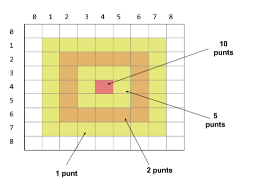

#FpInfor #DawMp03Uf04 #DawMp03Uf02 #Programació

Competició de dards digitals
=================================

Una colla de freaks ha inventat un joc de dards que funciona amb caselles quadrades. La diana parteix dels punts màxims en el centre i a cada anella va perdent la meitat dels punts (no es poden tenir decimals)

El joc és simple:

Tires els tres dards (amb les coordenades x i y) i reps la suma dels punts de la casella on ha caigut.

Activitat: Competició de dards
------------------------------------

Feu un programa que permeti que tres jugadors juguin a la competició de dards i determini quin dels dos ha guanyat.

Per tirar un dard cada jugador genera dos números (x i y) que és el lloc on s’enviarà el dard de la diana

